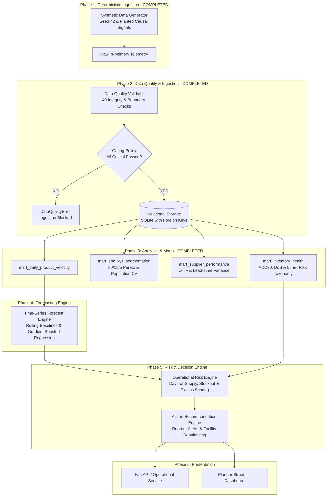

# System Architecture & Technical Specifications

## 1. Architectural Philosophy: Lean, High-Signal, Production-Appropriate

The system adheres strictly to the principle of **simplest production-appropriate engineering**:
- **No Over-Engineering**: Avoid premature distributed infrastructure (Kafka, Spark, Kubernetes, Celery, Vector DBs, LLM agents).
- **In-Process & Modular**: Data pipelines, analytical queries, forecasting routines, and risk scoring are built as composable Python modules backed by SQL storage.
- **Contract-Driven**: Strict separation between data contracts (Pydantic), persistent relational schemas (SQLAlchemy DDL), analytical transformations, and statistical models.
- **Deterministic & Reproducible**: Fully reproducible synthetic telemetry using pseudo-random seeds (`seed=42`) to enable rigorous integration testing and regression benchmarking.
- **Strict Quality Gating**: Automated 40-check validation suite gating all persistent database ingestion.
- **SQL-First Analytical Marts**: High-performance analytical views and summary tables for segmentation, supplier intelligence, and operational risk classification.

---

## 2. End-to-End System Data Flow



---

## 3. Relational Data Model & Analytical Marts

### Core Entity Tables
```
Table Scale Summary:
  calendar_dim         :    365 rows (Full year 2026 daily calendar dimension)
  products             :     15 rows (Catalog across Beverages, Snacks, Household, Personal Care)
  locations            :      5 rows (1 Central DC, 4 Regional Stores: NYC, BOS, MIA, SEA)
  suppliers            :      4 rows (Vendors with distinct lead time & reliability profiles)
  promotions           :      3 rows (Summer Refreshment, Fall Blitz, Holiday Event)
  sales_transactions   : 21,900 rows (365 days x 4 stores x 15 SKUs)
  inventory_snapshots  : 27,375 rows (365 days x 5 facilities x 15 SKUs)
  supplier_deliveries  :  2,388 rows (Inbound Purchase Orders & gate deliveries)
```

### Analytical Data Marts (Phase 3)
```
Analytical Marts Summary:
  mart_daily_product_velocity  : 21,900 rows (Daily sales, demanded units, revenue)
  mart_abc_xyz_segmentation    :     15 rows (SKU-level Pareto ABC + Volatility XYZ matrix)
  mart_supplier_performance    :      4 rows (Supplier OTIF, fill rate, lead-time stddev, spend)
  mart_supplier_sku_lead_times :     13 rows (Delivered supplier x SKU lead-time breakdowns)
  mart_inventory_health        :     75 rows (5 facilities x 15 SKUs as-of 2026-12-31)
```

---

## 4. Analytical Formulations & Mathematical Definitions

### A. ABC Revenue Pareto Segmentation
$$\text{Gross Revenue}_i = \sum_{t=1}^{365} \text{units\_sold}_{i,t} \times \text{unit\_price}_i$$
$$\text{Revenue Share}_i = \frac{\text{Gross Revenue}_i}{\sum_{k} \text{Gross Revenue}_k}$$
- **Class A**: Cumulative revenue share $\le 80.0\%$ (Top volume drivers)
- **Class B**: Cumulative revenue share between $80.0\%$ and $95.0\%$
- **Class C**: Cumulative revenue share $> 95.0\%$ (Long-tail items)

### B. XYZ Volatility Classification
Using daily network-wide demanded units over the full 365-day population:
$$\mu_i = \frac{1}{365} \sum_{t=1}^{365} \text{demand}_{i,t}, \quad \sigma_i = \sqrt{\frac{1}{365} \sum_{t=1}^{365} (\text{demand}_{i,t} - \mu_i)^2}$$
$$CV_i = \frac{\sigma_i}{\mu_i}$$
- **Class X**: $CV_i \le 0.50$ (High predictability / low variance staple)
- **Class Y**: $0.50 < CV_i \le 1.00$ (Medium predictability / seasonal or promo lift)
- **Class Z**: $CV_i > 1.00$ (Erratic / intermittent / slow-moving)

### C. Supplier OTIF & Lead-Time Analytics
$$\text{On-Time PO} = (\text{delay\_days} \le 0)$$
$$\text{In-Full PO} = (\text{qty\_received} \ge \text{qty\_ordered})$$
$$\text{OTIF PO} = \text{On-Time} \land \text{In-Full}$$
$$\text{OTIF Rate} = \frac{\sum \text{OTIF POs}}{\text{Total Delivered POs}}$$
$$\text{Lead-Time Standard Deviation} = \sqrt{\frac{1}{N} \sum (\text{lead\_time} - \overline{\text{lead\_time}})^2}$$

### D. Inventory Health & 5-Tier Operational Risk Taxonomy
As-of Date: $\max(\text{snapshot\_date}) = \text{2026-12-31}$.
$$\text{ADD}_{30} = \frac{1}{30} \sum_{t=-29}^{0} \text{units\_demanded}_t$$
$$\text{Available Stock} = \text{on\_hand\_qty} - \text{reserved\_qty}$$
$$\text{Days of Supply (DoS)} = \frac{\text{Available Stock}}{\max(0.01, \text{ADD}_{30})}$$

**Operational Risk Boundaries**:
$$\text{Risk Category} = \begin{cases} 
\text{CRITICAL} & DoS \le \text{Lead Time} \\ 
\text{LOW\_BUFFER} & \text{Lead Time} < DoS \le 1.5 \times \text{Lead Time} \\ 
\text{HEALTHY} & 1.5 \times \text{Lead Time} < DoS \le 45.0 \\ 
\text{ELEVATED\_BUFFER} & 45.0 < DoS \le 90.0 \\ 
\text{EXCESS} & DoS > 90.0 
\end{cases}$$

---

## 5. Evaluation Framework

| Evaluation Dimension | Metric / Validation Method | Target / Standard |
| :--- | :--- | :--- |
| **Data Integrity & Contracts** | Automated 40-check validation suite, `PRAGMA foreign_key_check`, zero orphan records. | 100% contract compliance, zero orphan records (Verified in Phase 2). |
| **Analytical Marts Integrity** | Relational joins, non-null velocity aggregates, 9-cell ABC/XYZ matrix, 5-tier risk taxonomy. | 100% complete coverage across 15 SKUs and 5 locations (Verified in Phase 3). |
| **Forecast Accuracy** | WAPE (Weighted Absolute Percentage Error), MAE, RMSE, Forecast Bias. | *To be measured in Phase 4.* |
| **Segment Error Analysis** | Accuracy sliced by ABC/XYZ velocity tiers and regional clusters. | *To be measured in Phase 4.* |
| **Risk Detection Precision** | Precision, Recall, and F1-score for predicting stockouts $\le 7$ days in advance. | *To be measured in Phase 5.* |
| **Prescriptive Impact** | Simulated avoided stockout revenue vs. incremental holding/expedite cost. | *To be measured in Phase 5.* |
| **Reproducibility** | Deterministic pipeline rerun with fixed seed (`seed=42`). | Identical logical records, marts, and segmentation across repeated runs. |
