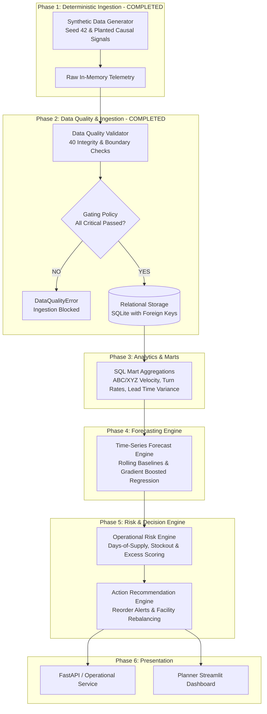
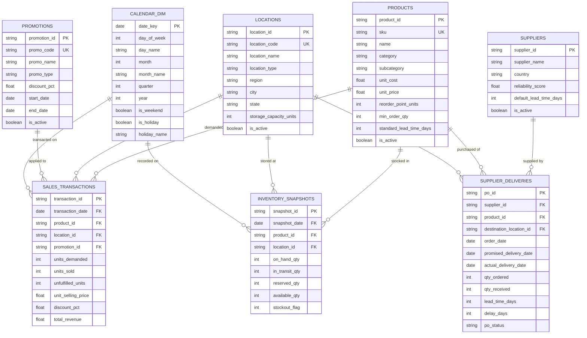

# System Architecture & Technical Specifications

## 1. Architectural Philosophy: Lean, High-Signal, Production-Appropriate

The system adheres strictly to the principle of **simplest production-appropriate engineering**:
- **No Over-Engineering**: Avoid premature distributed infrastructure (Kafka, Spark, Kubernetes, Celery, Vector DBs, LLM agents).
- **In-Process & Modular**: Data pipelines, analytical queries, forecasting routines, and risk scoring are built as composable Python modules backed by SQL storage.
- **Contract-Driven**: Strict separation between data contracts (Pydantic), persistent relational schemas (SQLAlchemy DDL), analytical transformations, and statistical models.
- **Deterministic & Reproducible**: Fully reproducible synthetic telemetry using pseudo-random seeds (`seed=42`) to enable rigorous integration testing and regression benchmarking.
- **Strict Quality Gating**: Automated 40-check validation suite gating all persistent database ingestion.

---

## 2. End-to-End System Data Flow



---

## 3. Relational Data Model & Dataset Scale

The data contract is built on 8 normalized relational tables populated by the generator (`seed=42`, 365 calendar days):

```
Table Scale Summary:
  calendar_dim         :    365 rows (Full year 2026 daily calendar dimension)
  products             :     15 rows (Catalog across Beverages, Snacks, Household, Personal Care)
  locations            :      5 rows (1 Central DC, 4 Regional Stores: NYC, BOS, MIA, SEA)
  suppliers            :      4 rows (Vendors with distinct lead time & reliability profiles)
  promotions           :      3 rows (Summer Refreshment, Fall Blitz, Holiday Event)
  sales_transactions   : 21,900 rows (365 days x 4 stores x 15 SKUs)
  inventory_snapshots  : 27,375 rows (365 days x 5 facilities x 15 SKUs)
  supplier_deliveries  :  2,388 rows (Inbound Purchase Orders & gate deliveries)
  -------------------------------------------------------------
  Total Database Rows  : 52,050 rows
```



---

## 4. Data Quality & Ingestion Validation Architecture

Before data is written to SQLite or PostgreSQL, it passes through `DataQualityValidator` evaluating **40 discrete checks**:

| Category | Check Count | Sample Rules Enforced | Severity Policy |
| :--- | :---: | :--- | :--- |
| **Table Sanity** | 8 | All 8 dimension and fact tables contain non-zero records. | CRITICAL |
| **Uniqueness** | 12 | Primary keys (`product_id`, `location_id`, etc.) and composite keys (`(snapshot_date, product_id, location_id)`) contain zero duplicates. | CRITICAL |
| **Referential Integrity** | 11 | All foreign keys in `sales_transactions`, `inventory_snapshots`, and `supplier_deliveries` strictly resolve to dimension tables. | CRITICAL |
| **Value Ranges** | 4 | `unit_price >= unit_cost > 0`, `reliability_score \in [0, 1]`, non-negative inventory and demand quantities. | CRITICAL |
| **Date Consistency** | 2 | `promotion.start_date <= promotion.end_date`, `order_date <= promised_delivery_date <= actual_delivery_date`. | CRITICAL |
| **Business Logic** | 3 | Exact arithmetic: `unfulfilled == demanded - sold`, `available == on_hand - reserved`, `stockout_flag == (1 if on_hand == 0 else 0)`. | CRITICAL |

---

## 5. Planted Causal Signals & Verified Ground Truth

The synthetic data engine embeds deterministic causal dynamics with verified measured ground truth:

1. **Promotional Demand Shock**:
   - Promotion: `PRM-SUMMER-26` (June 1 - June 14, 2026, 20% discount).
   - Target SKU: `PRD-BEV-001` (Cold Brew Coffee 12oz).
   - **Verified Ground Truth**: Non-promo mean demand = 34.56 units/day $\rightarrow$ Promo mean demand = 46.86 units/day (**+35.57% measured lift**).
2. **Upstream Supplier Inbound Delay**:
   - Inbound PO: `PO-000907` placed on 2026-05-24 by Store `LOC-ST-01` with `SUP-001`.
   - Promised Delivery Date: 2026-05-29 (5-day standard lead time).
   - Actual Delivery Date: 2026-06-07.
   - **Verified Ground Truth**: **+9 days measured delivery delay**.
3. **Causal Stockout Crisis**:
   $$\text{Promotional Surge (+35.57\%)} + \text{Inbound PO Delay (+9 Days)} \longrightarrow \text{Inventory Depletion} \longrightarrow \text{Stockout Crisis}$$
   - **Verified Ground Truth**: 8 stockout days recorded (2026-06-01 to 2026-06-06, 2026-06-11 to 2026-06-12) with **334 total unfulfilled customer demand units**.
4. **Regional Seasonal Wave**:
   - Target SKU: `PRD-SEA-001` (Electrolyte Hydration Drink).
   - **Verified Ground Truth**: South Region (`LOC-ST-03` Miami) summer mean demand = 18.74 units/day vs. winter mean demand = 10.64 units/day (**1.76x summer uplift**).
5. **Slow-Moving Capital Drag**:
   - Target SKU: `PRD-HOU-003` (Industrial Floor Degreaser 1Gal).
   - **Verified Ground Truth**: Daily demand = 0.199 units/day, Average Store Stock = 85.1 units (**428.3 days of supply**).
6. **Steady-State Benchmark**:
   - Target SKU: `PRD-BEV-003` (Classic Mineral Water 1L).
   - **Verified Ground Truth**: 0 stockout days across all stores over the full 365-day year.

---

## 6. Evaluation Framework

| Evaluation Dimension | Metric / Validation Method | Target / Standard |
| :--- | :--- | :--- |
| **Data Integrity & Contracts** | Automated 40-check validation suite, `PRAGMA foreign_key_check`, zero orphan records. | 100% contract compliance, zero orphan records (Verified in Phase 2). |
| **Forecast Accuracy** | WAPE (Weighted Absolute Percentage Error), MAE, RMSE, Forecast Bias. | *To be measured in Phase 4.* |
| **Segment Error Analysis** | Accuracy sliced by ABC/XYZ velocity tiers and regional clusters. | *To be measured in Phase 4.* |
| **Risk Detection Precision** | Precision, Recall, and F1-score for predicting stockouts $\le 7$ days in advance. | *To be measured in Phase 5.* |
| **Prescriptive Impact** | Simulated avoided stockout revenue vs. incremental holding/expedite cost. | *To be measured in Phase 5.* |
| **Reproducibility** | Deterministic pipeline rerun with fixed seed (`seed=42`). | Identical logical records and 100% passing quality checks across repeated runs. |
