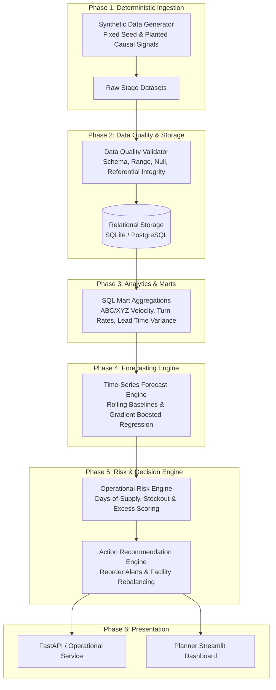

# System Architecture & Technical Specifications

## 1. Architectural Philosophy: Lean, High-Signal, Production-Appropriate

The system adheres strictly to the principle of **simplest production-appropriate engineering**:
- **No Over-Engineering**: Avoid premature distributed infrastructure (Kafka, Spark, Kubernetes, Celery, Vector DBs, LLM agents).
- **In-Process & Modular**: Data pipelines, analytical queries, forecasting routines, and risk scoring are built as composable Python modules backed by SQL storage.
- **Contract-Driven**: Strict separation between data contracts (Pydantic), persistent relational schemas (SQLAlchemy DDL), analytical transformations, and statistical models.
- **Deterministic & Reproducible**: Fully reproducible synthetic telemetry using pseudo-random seeds to enable rigorous integration testing and regression benchmarking.

---

## 2. End-to-End System Data Flow

---

## 3. Relational Data Model (Core Entities)

The data contract is built on 8 normalized, high-utility relational tables:

---

## 4. Core Business Questions Answered

### A. Demand Intelligence
- What is the expected daily/weekly demand for each SKU-location node over the 14-day and 30-day forecast horizons?
- How much incremental demand lift is attributable to active promotional campaigns vs. seasonal baseline variation?

### B. Operational Risk Detection
- Which product-location pairs will experience stockouts before the next replenishment delivery arrives?
- Which SKUs exceed the maximum holding capacity threshold or safe days-of-supply (>90 days of inventory)?

### C. Root-Cause Drivers
- Is an emerging stockout caused by:
  1. An unexpected demand surge (promotional or unmodeled spike)?
  2. Supplier fulfillment delay (actual lead time > promised lead time)?
  3. Under-replenishment (reorder point set too low relative to velocity)?

### D. Prescriptive Business Actions
- What specific purchase orders should be placed today (SKU, destination, recommended quantity)?
- Can an impending stockout at a retail store be mitigated via an expedited regional distribution center (DC) cross-dock transfer?

### E. Model & Performance Monitoring
- What is the out-of-sample forecast accuracy (MAE, WAPE, Bias) across product velocity categories (Fast-moving Class A vs. Slow-moving Class C)?
- What is the precision and recall of stockout alerts generated by the risk engine?

---

## 5. Planted Causal Signals (Synthetic Ground Truth)

To ensure the system is evaluated against ground truth, the synthetic data generator implements deterministic, causal business dynamics:

1. **Promotional Demand Shock**: A planned 2-week discount promotion (+35% demand lift) on high-velocity SKUs in specific urban stores.
2. **Upstream Supplier Bottleneck**: A key supplier experiences a 9-day fulfillment latency spike during the promotional period.
3. **Causal Stockout Crisis**:
   $$\text{Promotional Demand Surge} + \text{Supplier Inbound Delay} \longrightarrow \text{Inventory Depletion} \longrightarrow \text{Stockout (Unfulfilled Demand)}$$
4. **Seasonal Weather Wave**: Summer category demand uplift in Southern locations with corresponding decline in Northern regions.
5. **Slow-Moving Capital Drag**: Low-velocity SKUs subject to minimum order quantity batching, leading to >120 days of supply and excess holding costs.
6. **Reliable Steady-State Baselining**: Core staple SKUs exhibiting low-variance Poisson demand for baseline forecasting validation.

---

## 6. Evaluation Framework

| Evaluation Dimension | Metric / Validation Method | Target / Standard |
| :--- | :--- | :--- |
| **Data Integrity & Contracts** | Great Expectations / Pydantic schema validation, null checks, foreign key validity. | 100% contract compliance, zero orphan records. |
| **Forecast Accuracy** | WAPE (Weighted Absolute Percentage Error), MAE, RMSE, Forecast Bias. | *To be measured in later phases.* |
| **Segment Error Analysis** | Accuracy sliced by ABC/XYZ velocity tiers and regional clusters. | *To be measured in later phases.* |
| **Risk Detection Precision** | Precision, Recall, and F1-score for predicting stockouts $\le 7$ days in advance. | *To be measured in later phases.* |
| **Prescriptive Impact** | Simulated avoided stockout revenue vs. incremental holding/expedite cost. | *To be measured in later phases.* |
| **Reproducibility** | Deterministic pipeline rerun with fixed seed. | Identical checksums on generated tables. |
